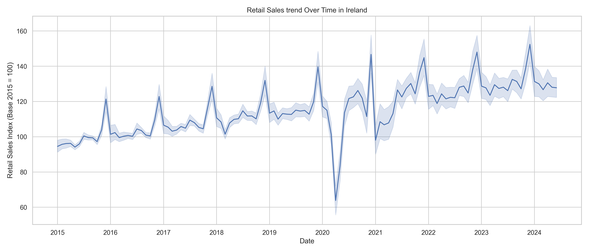
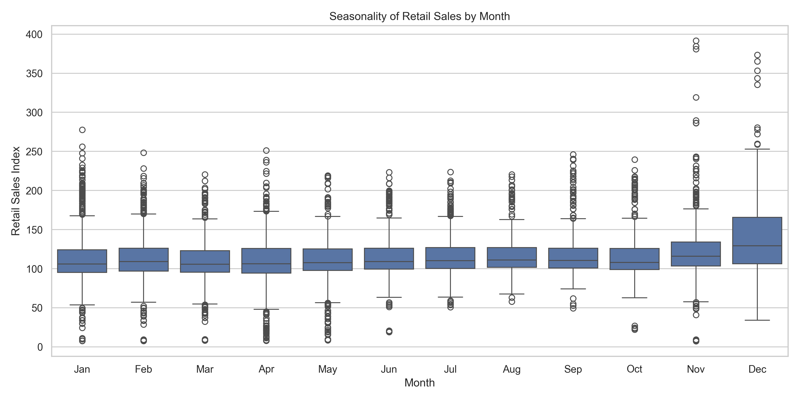
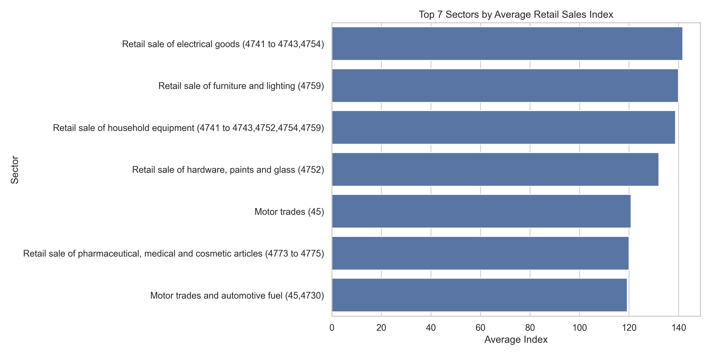

# 🛍️ Exploratory Data Analysis (EDA) of Retail Sales in Ireland (2009–2025)

This project presents a professional Exploratory Data Analysis (EDA) of Ireland’s official Retail Sales Index, published by the Central Statistics Office (CSO).

The goal is to extract patterns, trends, and actionable insights to support business, economic, and strategic decision-making.

---

## 📁 Dataset

- **Source**: [CSO Ireland – Retail Sales Index (RSM05)](https://data.cso.ie/table/RSM05)
- **Period**: Jan 2009 – Mar 2025
- **Granularity**: Monthly
- **Fields**: Date (month), Sector, Retail Sales Index (Base 2015 = 100)

---

## 🧠 Executive Summary

This exploratory analysis investigates monthly retail sales in Ireland from 2009 to 2025 using data from CSO. The goal was to extract patterns, identify top-performing sectors, and provide insights useful for business and economic interpretation.

---

## 🔍 Key Findings

- **Seasonality is Strong**: Irish retail sales consistently spike in **November and December**, reflecting holiday demand. The lowest activity is often in **January**, suggesting opportunities for promotions or cost control.

- **Top Sectors**: Over the years, sectors such as **Supermarkets, Fuel, and Hardware Stores** maintained higher-than-average indices — indicating strong demand resilience even through crises.

- **COVID-19 Disruption**: 2020 shows a **dramatic drop** in sales, especially in non-essential sectors. Recovery patterns vary post-pandemic, emphasizing different rebound speeds by sector.

---

## 📊 Visual Analysis

### 📈 Retail Sales Trend Over Time

---

### 📅 Seasonality by Month

---

### 🏆 Top Performing Sectors

---

## 💡 Business Impact

- **Stock and staffing strategies** can be improved using seasonal patterns.
- Investors and decision-makers can use sector performance data to assess retail stability.
- Policymakers might use this to design support plans for lagging sectors or during crises.

---

## ✅ Conclusion

This EDA project shows how raw sales data can become powerful insights for business, government, and research when approached with structured methodology and clarity in storytelling.

It also demonstrates:

- Proficiency with real-world messy data
- Modular code organization
- Data visualization for business understanding

---

## ⚙️ Tech Stack

| Tool           | Purpose                         |
|----------------|---------------------------------|
| Python         | Data wrangling & visualization  |
| Pandas         | Data manipulation               |
| Matplotlib     | Static graphs                   |
| Seaborn        | Statistical visualizations      |
| Git            | Version control                 |
| GitHub         | Portfolio / versioned delivery  |

---

## 📬 Contact

Made by **Luiz Otavio Marangão Souza** 🇮🇪  
[LinkedIn](https://www.linkedin.com/in/luiz-otavio-creator)  
📧 luizotaviomarangaoit@gmail.com

Why This Analysis Matters

🔹 1. Overall Retail Sales Trend (2009–2025)

The index shows a general upward trend across the decade, with more volatile shifts beginning in 2020. From 2009 to 2019, sales grew steadily, reflecting a stable economic cycle.

However, 2020 marks a significant breakpoint. COVID-19 triggered a sharp drop in sales, hitting non-essential retail sectors the hardest.

After this shock, partial but uneven recovery is visible:

Essential sectors (e.g., groceries, fuel) recovered quickly

Sectors tied to physical interaction took longer to rebound

Conclusion:

The pandemic revealed the adaptive capacity of each sector. Resilient industries maintained performance, while others highlighted structural vulnerabilities.

🔹 2. Strong, Predictable Seasonality

A clear monthly pattern emerges:

Sales spike in November and December, aligned with Black Friday, Christmas, and year-end bonuses

Sales drop significantly in January and February, likely due to post-holiday financial restraint

Conclusion:

Companies should prepare stock, logistics, and staffing for Q4 demand peaks, while planning for leaner periods early in Q1.

🔹 3. Top Performing Sectors by Average Index

Sectors with the highest average performance over the full period:

Supermarkets & Convenience

Automotive Fuel

Hardware, Paints & Glass

These sectors:

Met basic and recurring consumer needs

Demonstrated resilience even during economic turbulence

Conclusion:

Investors, planners, and retailers can rely on these categories for more stable ROI and risk-managed expansion.

📁 Strategic Takeaways

✅ Use seasonality to time campaigns, workforce planning, and pricing strategies

✅ Monitor sector-level performance to assess economic stability or recovery

✅ Guide policy or support planning by identifying lagging industries

✅ Final Thoughts

This EDA transforms raw time-series retail data into business-aligned intelligence.

It demonstrates:

Real-world data preprocessing and cleaning

Visual storytelling through charts

Sector performance benchmarking

Business and policy relevance

This analysis serves as a foundation for future forecasting models and strategic dashboards.

